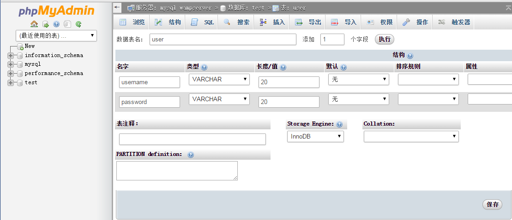
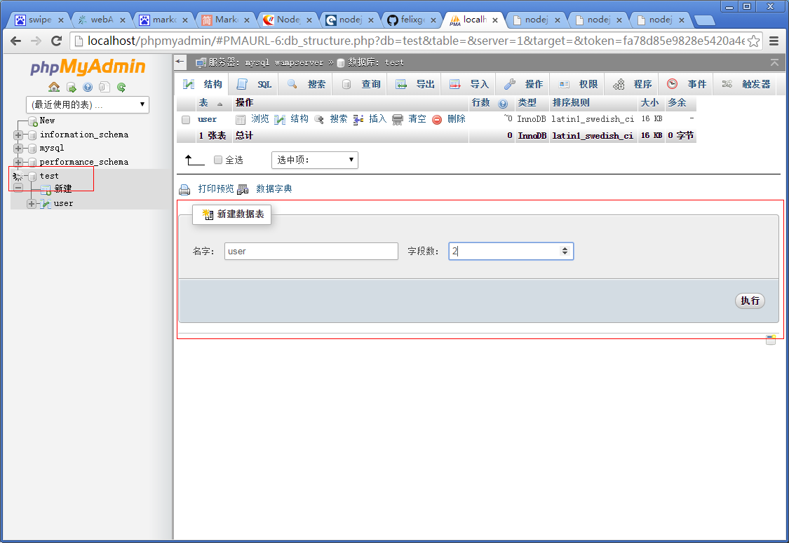
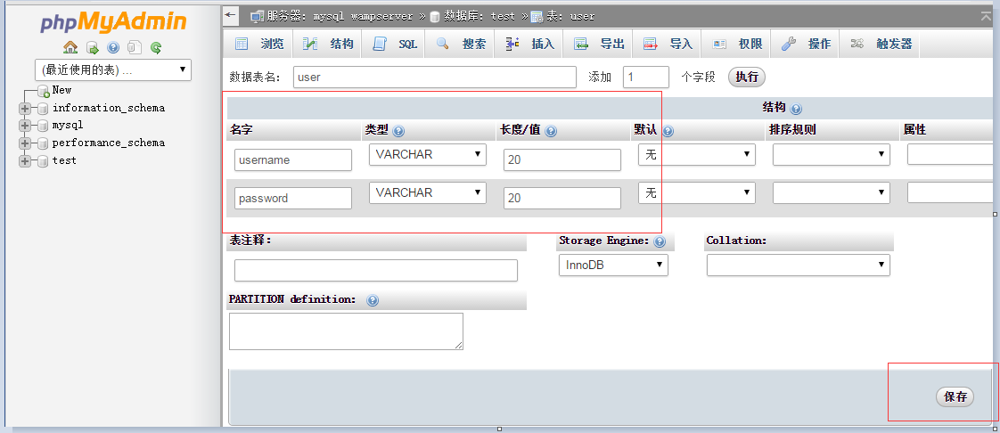
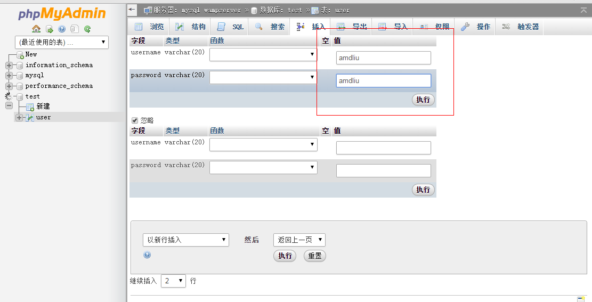

#nodejs连接mysql数据库

###mysql
mysql数据库及其可视化管理工具有很多，这里采用wamp环境的mysql和phpMyAdmin可视化管理工具，只要下载一个wamp集成包，直接安装即可。安装完启动后，会在右下角有服务器的图标(如图一所示)，如果点击“phpMyAdmin”能打开phpMyAdmin界面(如图二所示)则表示mysql+phpMyAdmin可视化工具安装成功。

图一：软件界面图

图二：phpMyAdmin管理工具界面

###node-mysql
node-mysql是nodejs连接数据的一个依赖包，在cmd中通过cd打开nodejs项目，并通过以下命令安装这个包
	
	npm install mysql

可以用下面命令安装node-mysql的最新版本

	npm install felixge/node-mysql

安装好后，在app.js中加入下面代码，测试能否成功连接数据库:

	var mysql = require('mysql');
	var connection = mysql.createConnection({
		host:'localhost',
		user:'root',
		password:''
	});
	connection.connect();

	connection.query('select 1+1 as solution',function(err,rows,fields){

		if(err)
		{
			console.log(err);
			throw err;
		}

		console.log("the result is:"+rows[0].solution);
	});

	connection.end();

如果node bin/www后得到结果：the result is 2，则表明已经成功完成数据库连接。

###完善登录功能
下面将通过数据库操作来完善[web后端开发](https://github.com/acdliu/Blog/blob/gh-pages/nodejs_study/web%E5%90%8E%E7%AB%AF%E5%BC%80%E5%8F%91.md)，具体操作如下：

首先在mysql中test库下新建一个有2个字段的user表，具体步骤如下所示:

- 点击"test"，在右边输入信息，点"执行"即可创建一个表，如下图所示:

- user表的字段及其相应属性如下表所示:

<table>
	<tr>
		<td>字段名</td>
		<td>类型</td>
		<td>长度</td>
		<td>是否可以为Null</td>
	</tr>
	<tr>
		<td>username</td>
		<td>varchar</td>
		<td>20</td>
		<td>not null</td>
	</tr>
	<tr>
		<td>password</td>
		<td>varchar</td>
		<td>20</td>
		<td>not null</td>
	</tr>
</table>

具体填写内容如下图所示：

- 然后在user表中，点击导航上的"插入"，在页面中输入插入信息，然后点"执行"即可。

然后加入创建数据库连接代码:

	var mysql = require('mysql');
	var conn = mysql.createConnection({
		host:'localhost',//主机名，这里用本机
		user:'root',//数据库用户名
		password:'',//数据库密码
		db:'test'//使用的数据库名
	});
	conn.connect();

在登录功能模块验证用户名和密码与数据库中的是否一致，登录成功后会返回用户名和密码，失败会重定向到login页面，具体代码如下：

	app.post('/loginLogic',function(err,res,fields){

		//获取用户信息
		var usernameB = req.body.username;
		var passwordB = req.body.password;

		//用用户信息拼接sql语句
		var sql = 'select * from user where username="'+usernameB+'" and password="'+passwordB+'"';

		//数据库查询完毕后调用函数
		var successHandle = function(result){

			if(result.length > 0)
			{
				console.log('对不起，你的用户名和密码输入有错');
				res.redirect('/login');
			}
			else
			{
				console.log('恭喜你，登录成功');
				res.render('index',{{username:usernameB,password:passwordB}});
			}
		}

		//执行数据库查询操作
		conn.query(sql,function(err,res,fields){

			if(err){
				console.log("你的sql语句有问题");
				throw err;
			}

			successHandle(res);

		});

	});

启动项目即可，访问localhost:3000/login测试即可。

