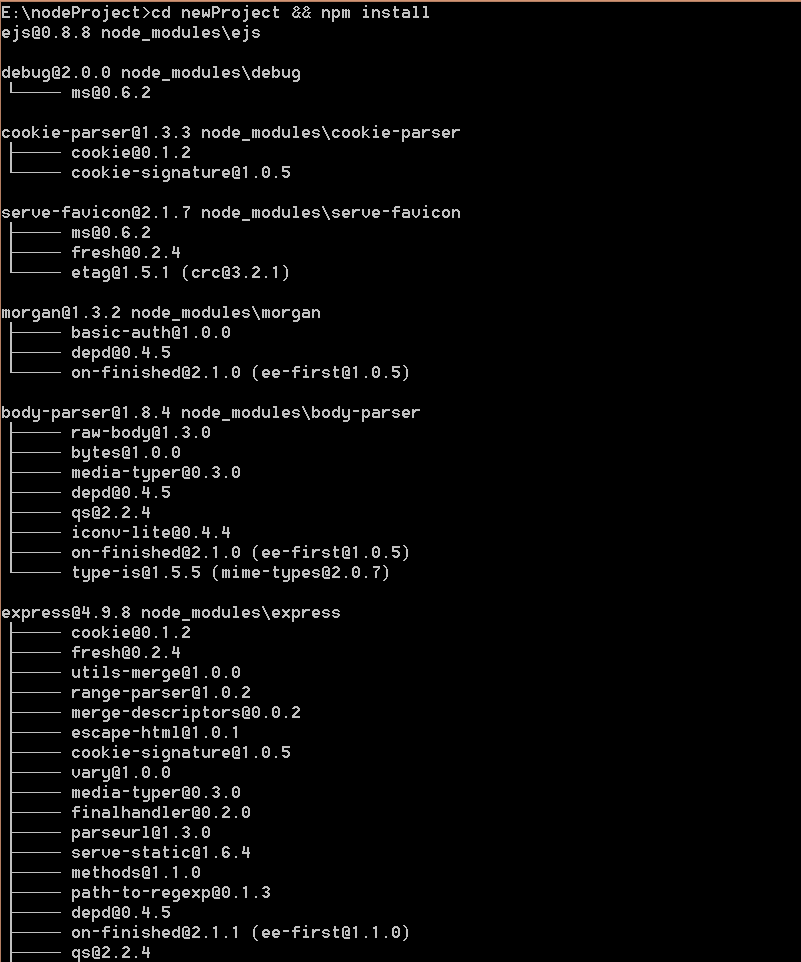

#nodejs+npm+express环境搭建

###一、nodejs安装
1、在[nodejs官网](http://nodejs.org/)上点击install按钮即可下载nodejs安装文件。

2、运行安装文件，配置安装路径，其他配置项按默认配置，直接下一步到完成。

3、打开cmd，运行下面命令查看nodejs的版本信息，如果成功显示表示安装成功，如果提示node不是内部命令时请重新安装。

	node -v

###二、npm管理工具安装
1、最新版本的nodejs(window环境)已经集成了npm管理工具，输入下面命令查看npm版本，如果提示npm不是系统内部命令时，请重新安装nodejs。

	npm -v

2、如果电脑是通过代理来上网时，还需要通过下面代码配置npm的代理，否则在通过npm来安装依赖包试会有网络错误，同时还要将浏览器设置为localhost*和1127.0.0.1*不使用代理。

	npm config set proxy=代理地址
	example:npm config set proxy=http://127.0.0.1

###三、express4.0以上版本安装
1、通过下面代码来将express依赖包安装在全局环境中。

	npm install -g express

2、安装完express依赖包后，还要安装一个express-generator包才能正常使用express命令，如果是express4.0之前的版本则不用装。

	npm install -g express-generator

3、输入下面代码，如果能看到版本号则表示express安装成功，否则请重复上面步骤。

	express -V

###四、第一个web应用
1、win+R输入cmd打开命令行工具，输入以下命令：

	express -e 项目名

2、根据express的提示安装依赖包

	cd newProject && npm install

3、输入下面命令运行项目,然后在浏览器输入http://localhost:3000，如果能看到express的欢迎界面表示整个环境搭建成功。
	
	node ./bin/www

