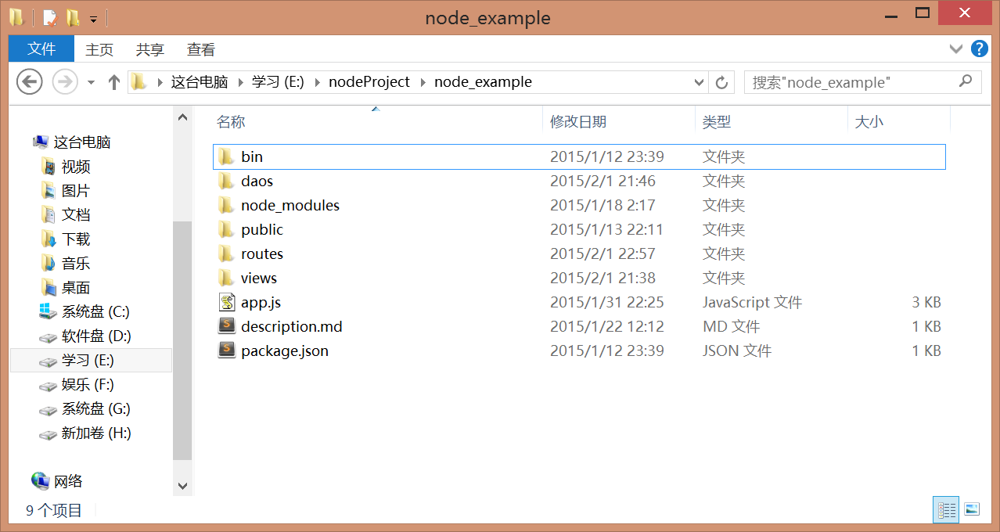

#小项目

>前面已经将web开发的前端和后台基础了解了，现在结合之前的信息来做一个实现认证模块和用户模块的一个小项目

###一、项目需求
+ 1、用户注册
+ 2、用户登录
+ 3、用户提交故障单
+ 4、用户查看故障单

###二、项目环境
本项目采用nodejs+express+redis+mysql来搭建

#####nodejs+express+mysql环境搭建
如未清楚，请点击[nodejs+express](https://github.com/acdliu/Blog/blob/gh-pages/nodejs_study/nodejs%E7%8E%AF%E5%A2%83%E6%90%AD%E5%BB%BA.md)和[mysql]()

#####redis安装及配置
nodejs是单线程的，所以它的session存储方式与J2ee不同。j2ee通常将session存储在一个线程的变量中，也就是说内存中，而nodejs采用是存在数据库中。redis是一个类memcached的key-value存储系统，它有很多有点，下面介绍redis的安装和使用。

在[redis](http://redis.io)网站的导航条中选择download一个win64的版本，不兼容32位系统。32位版本已经弃用，32位系统的电脑请百度redis x86版本。下载完后解压到指定目录，打开目录下的redis-server,即可以启用redis服务。

###三、项目设计
####目录设计
目录组织方式采用类似J2EE项目的文件组织方式，具体如下图所示：

views:视图层，存放html模版文件
routes:控制器，存放路由js文件
daos: DAO组件层
public:存放javascript、css、js和图片等资源文件夹

####数据表设计
这个小项目只涉及到用户模块，没有涉及到管理模块，所以只需要以下两个表信息：

user

<table>
	<tr>
		<td>字段名</td>
		<td>类型</td>
		<td>长度</td>
		<td>是否可为空</td>
		<td>其他</td>
	</tr>
	<tr>
		<td>id</td>
		<td>number</td>
		<td>无</td>
		<td>不可</td>
		<td>这个字段是自增字段，且是primary字段</td>
	</tr>
	<tr>
		<td>username</td>
		<td>varchar</td>
		<td>20</td>
		<td>不可</td>
		<td>这个是unqie字段，也可以做primary使用</td>
	</tr>
	<tr>
		<td>password</td>
		<td>varchar</td>
		<td>20</td>
		<td>不可</td>
		<td>无</td>
	</tr>
	<tr>
		<td>type</td>
		<td>varchar</td>
		<td>20</td>
		<td>不可</td>
		<td>这个是用户类型</td>
	</tr>
</table>

itsmerror

<table>
	<tr>
		<td>字段名</td>
		<td>类型</td>
		<td>长度</td>
		<td>是否可为空</td>
		<td>其他</td>
	</tr>
	<tr>
		<td>id</td>
		<td>number</td>
		<td>无</td>
		<td>不可</td>
		<td>这个字段是自增字段，且是primary字段</td>
	</tr>
	<tr>
		<td>title</td>
		<td>varchar</td>
		<td>50</td>
		<td>不可</td>
		<td>无</td>
	</tr>
	<tr>
		<td>description</td>
		<td>varchar</td>
		<td>50</td>
		<td>不可</td>
		<td>无</td>
	</tr>
	<tr>
		<td>mobilePhone</td>
		<td>varchar</td>
		<td>16</td>
		<td>不可</td>
		<td>无</td>
	</tr>
	<tr>
		<td>phone</td>
		<td>varchar</td>
		<td>16</td>
		<td>不可</td>
		<td>无</td>
	</tr>
	<tr>
		<td>roomID</td>
		<td>varchar</td>
		<td>20</td>
		<td>可以</td>
		<td>无默认值</td>
	</tr>
	<tr>
		<td>IP</td>
		<td>varchar</td>
		<td>15</td>
		<td>可以</td>
		<td>无默认值</td>
	</tr>
	<tr>
		<td>file</td>
		<td>varchar</td>
		<td>20</td>
		<td>可以</td>
		<td>这个字段是存储文件路径的</td>
	</tr>
	<tr>
		<td>handper</td>
		<td>varchar</td>
		<td>20</td>
		<td>不可</td>
		<td>这个字段取自session值</td>
	</tr>
	<tr>
		<td>delper</td>
		<td>varchar</td>
		<td>20</td>
		<td>不可</td>
		<td>这个字段默认值为"123456"</td>
	</tr>
</table>
####路径设计
/index，首页:dataShow.html，显示用户提交的所有故障单信息
/login，login页面:login.html，显示用户登录页面，这个要强制https。
/loginLogic，无页面，处理用户登录请求页面
/reg，reg页面:reg.html，显示用户注册页面，这个要强制https。
/regLogic，处理用户提交信息页面
/errorCreate，创建故障单页面:dataShow1.html,显示创建故障单页面，这个需要用户登录后才可以访问

###四、各目录下文件介绍

####views内页面文件及代码
- 1、login.html登录页面
- 2、reg.html注册界面
- 3、dataShow.html显示用户故障单信息页面
- 4、dataShow1.html用户提交故障单页面

####routes内文件及代码
- 1、authentication.js用户模块，该模块提供用户提单和差单功能。
- 2、unauthentication.js认证模块，该模块提供用户登录和注册功能。
- 3、index.js路由分发模块，将相应的路径发送到相应的功能模块。

####daos内文件
- 1、mysqlHelper.js提供数据库连接信息
- 2、itsmDAO.js提供操作itsmerror表信息功能模块
- 3、userDao.js提供操作user表信息功能模块

项目具体内容将在下次附上。

