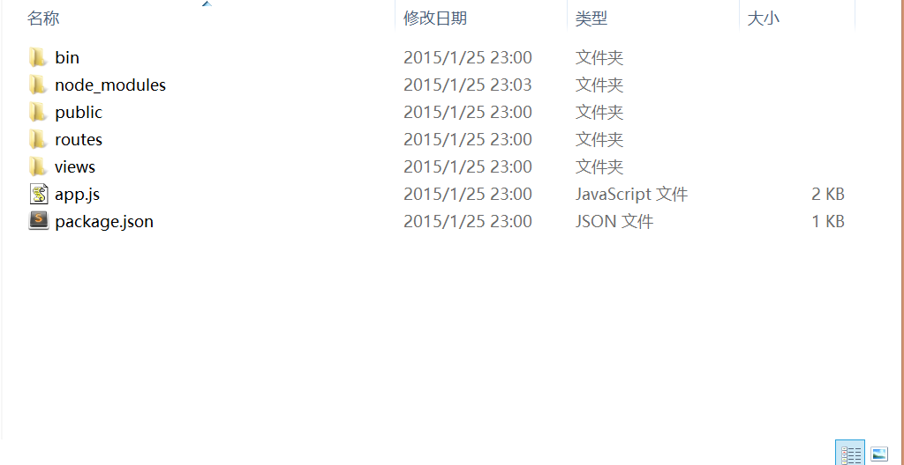

#Web后端开发
之前已经说过如何搭建[nodejs后台环境](https://github.com/acdliu/Blog/blob/gh-pages/nodejs_study/nodejs%E7%8E%AF%E5%A2%83%E6%90%AD%E5%BB%BA.md)，本文将介绍如何通过nodejs+express+ejs模板来拦截用户请求和返回数据

###nodejs+express项目目录

- bin 这个目录里有一个www文件，这个是这个项目的启动程序，在此目录下node www可以开启node服务器
- node_modules 这个目录是存放通过npm安装的依赖包文件
- public 这个目录是用来存放图片、javascript和css以及一些其他共享文件的目录
- routes 这个目录存放controller层的代码，可以进行访问控制
- views 这个目录存放模板引擎和前端页面
- app.js 这个是express框架的nodejs服务器编程入口文件
- package.json 这个json文件是用来配置项目信息的

###app.js介绍
	
	/**
	*引入外部依赖模块
	*/
	var express = require('express');
	var path = require('path');
	var favicon = require('serve-favicon');
	var logger = require('morgan');	
	var cookieParser = require('cookie-parser');
	var bodyParser = require('body-parser');
	/**
	*引入项目内部依赖模块
	*/
	var routes = require('./routes/index');
	var users = require('./routes/users');

	var app = express();

	/**
	*设置模板引擎
	*/
	//设置模板的路径
	app.set('views', path.join(__dirname, 'views'));
	//设置模板文件类型
	app.set('view engine', 'ejs');

	/**
	*使用中间件
	*/
	app.use(logger('dev'));
	app.use(bodyParser.json());
	app.use(bodyParser.urlencoded({ extended: false }));
	app.use(cookieParser());
	//这个是设置静态路径，设置后可直接使用该路径内的文件
	app.use(express.static(path.join(__dirname, 'public')));

	/**
	*路由功能模块
	*/
	//使用routes中间件来处理http://localhost:3000/请求
	app.use('/', routes);
	//使用users中间件来处理http://localhost:3000/users请求
	app.use('/users', users);
	//404页面
	app.use(function(req, res, next) {
    	var err = new Error('Not Found');
    	err.status = 404;
    	next(err);
	});

	//开发者环境
	if (app.get('env') === 'development') {
    	app.use(function(err, req, res, next) {
        	res.status(err.status || 500);
        	res.render('error', {
            	message: err.message,
            	error: err
        	});
    	});
	}

	// 500错误页面
	app.use(function(err, req, res, next) {
    	res.status(err.status || 500);
    	res.render('error', {
        	message: err.message,
        	error: {}
    	});
	});

	module.exports = app;

这里在引入文件时要注意，在nodejs中模块分为文件模块和核心模块，核心模块即express框架项目下的node_modules文件夹内的模块，使用require("文件名"),即可引用核心模块。要引用内部文件模块时，需要在文件路径前加/或./，否则nodejs会在node_modules的文件夹内查找该核心模块。

###设置html模板
这里我不是很习惯ejs模版的写法，所以这里修改下配置，使用html做为模板，模板引擎还是ejs。

- 首先要在项目中引入ejs模块，在app.js引入外部依赖模块下加入下面一行代码
	
	var ejs = require("ejs");

- 接下来我们要配置ejs模板引擎来解析html文件，在设置模板引擎代码下加入下面一行代码

	app.engine('.html',ejs.__express);

- 最后将设置模板文件类型代码改成以下内容：
	
	app.set('view engine', 'html');

###路由
nodejs的路由模块有拦截，转发和处理请求功能，它提供了三个拦截请求的方法：
	
	app.get(path,callback);
	app.post(path,callback);
	app.all(path,callback);

这三个方法可以用来处理全部请求。path是用户提交请求的的路径。callback处理该请求的函数，它有三个参数req、res和next，分别封装请求内容及操作、响应内容及其操作方法和向下执行函数(使用了这个函数，会继续往后面app的get/post/all/use方法传递请求)。nodejs+express的路由模块有一点要注意，路由里面的函数是由上往下执行的，比如说下面的几个拦截器：

	app.all("*",function(res,req,next){

		console.log("here is app.all method");
		next();
	});

	app.use("*",function(res,req,next){

		console.log("here is app.use all method");
		next();
	});

	app.get("/login",function(res,req,next){

		console.log("here is app.get all method");
		next();
	});

运行下面项目，在浏览器输入http://localhost:3000/login，可以看到弹出404或500页面。我们看下黑屏里面的内容，可以看出代app.all先拦截到请求，处理完成后使用next()向后传递请求数据，然后app.use拦截到请求，处理完成后使用next()继续向后传递请求，最后才被app.get请求拦截。可以看出请求不是直接被app.get拦截到，而是由上往下的捕获的。另外，不使用next函数，数据传递到app.all就停止往下传递了。所以我们可以利用这个特性来做过滤器，本文暂时还用不到这个内容，该功能将于下次说明。

现在我们设计一个返回用户提交过来的登录信息的功能的需求
访问路径：/login,页面：login.html
访问路径：/loginLogic，页面：index，返回用户提交过来的信息
在app.js的路由模块代码中加入一下代码
	
	
	app.get('/login',function(req,res,next){

    	return res.render('login',{title:"用户登录界面"});
	});
	app.post('/loginLogic',function(req,res,next){

    	//先获取用户传递过来的请求信息
    	var usernameB = req.body.username;
    	var passwordB = req.body.password;

    	return res.render('index',{username:usernameB,password:passwordB});
	});

下面将前端页面放到views目录下：
	
	index.html页面代码
	<!DOCTYPE html>
	<html>
		<head>
			<meta charset="utf-8">
			<title>index page</title>
		</head>
		<body>
			
<%= username %>！您好，您的密码是<%= password %>

		</body>
	</html>

	login.html页面代码
	<!DOCTYPE html>
	<html>
		<head>
			<meta charset="utf-8" >
			<title><%= title %></title>
		</head>
		<body>
		<form method="post" action="http://localhost:3000/loginLogic">
			<fieldset>
				<legend>用户登录</legend>
				
<label>用户名：</label><input type="text" name="username">

				
<label>密码：</label><input type="password" name="password">

				
<button>submit</button>

			</fieldset>
		</form>
		</body>
	</html>

运行项目，在ie浏览器输入http://localhost:3000/login页面地址并输入信息，点击submit就可以看到自己提交过去的数据。

